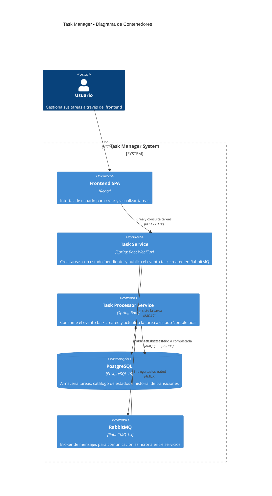

## C4 - Diagrama de Contenedores

```mermaid
C4Container
    title Task Manager - Diagrama de Contenedores

    Person(user, "Usuario", "Gestiona sus tareas a través del frontend")

    System_Boundary(system, "Task Manager System") {

        Container(frontend, "Frontend SPA", "React", "Interfaz de usuario para crear y visualizar tareas")

        Container(taskService, "Task Service", "Spring Boot WebFlux", "Crea tareas con estado 'pendiente' y publica el evento task.created en RabbitMQ")

        Container(taskProcessor, "Task Processor Service", "Spring Boot", "Consume el evento task.created y actualiza la tarea a estado 'completada'")

        ContainerDb(postgres, "PostgreSQL", "PostgreSQL 15", "Almacena tareas, catálogo de estados e historial de transiciones")

        Container(rabbit, "RabbitMQ", "RabbitMQ 3.x", "Broker de mensajes para comunicación asíncrona entre servicios")
    }

    Rel(user, frontend, "Usa", "HTTPS")
    Rel(frontend, taskService, "Crea y consulta tareas", "REST / HTTP")
    Rel(taskService, postgres, "Persiste la tarea", "R2DBC")
    Rel(taskService, rabbit, "Publica task.created", "AMQP")
    Rel(rabbit, taskProcessor, "Entrega task.created", "AMQP")
    Rel(taskProcessor, postgres, "Actualiza estado a completada", "R2DBC")
```
